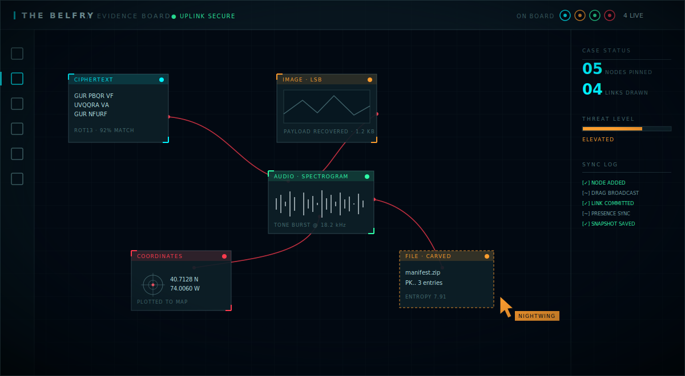
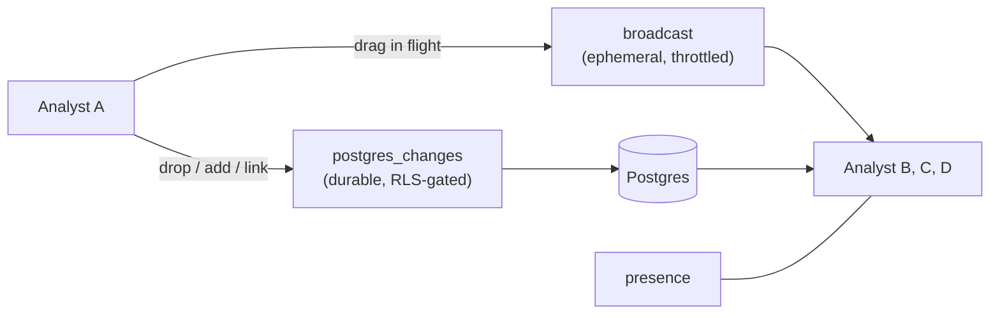
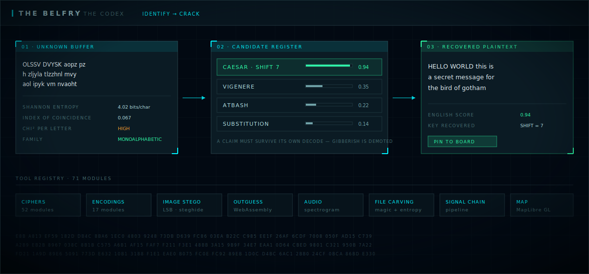
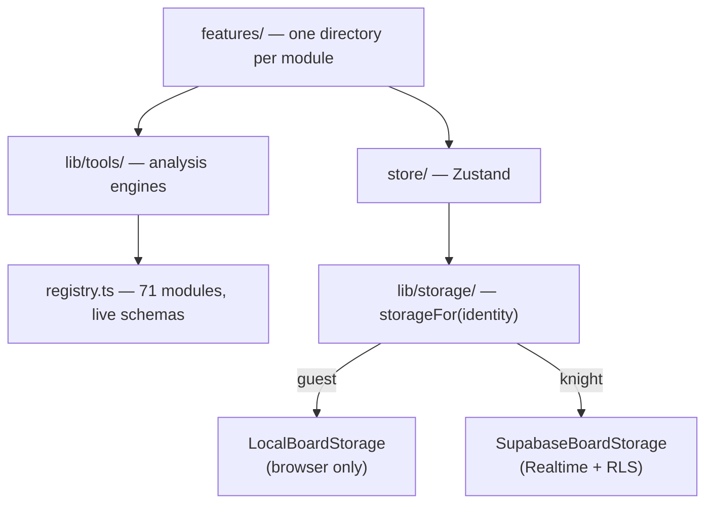

<div align="center">

# The Belfry

**A Batcomputer-styled cryptanalysis and digital-forensics workbench.**

71 analysis modules · image & audio steganography · tactical map ·
a realtime **multiplayer evidence board**

[](LICENSE)


</div>

---

Drop in a file or paste something unreadable, and The Belfry tells you what it is
and hands you the tool that cracks it. Then pin the result to a corkboard your
whole team is standing around — live.

Built as a CTF and puzzle-solving companion, wrapped in an Arkham-inspired
tactical HUD.

> **Zero-config.** Clone, `npm install`, `npm run dev` — every tool works offline
> with no account and no network. Multiplayer is opt-in and uses **your own**
> Supabase project.

---

## The multiplayer evidence board

The centrepiece. A shared corkboard where several analysts pin evidence, draw
connections, and work a case together in real time.



<sub>*Illustrative mockup rendered in the app's own design tokens.*</sub>

Two channels do the work, and the split matters:



- **Durable state** — nodes, links, and case status go through Postgres and
  replicate via `postgres_changes`. Realtime honours RLS, so a non-knight
  receives nothing.
- **In-flight drag** — dragging a card would otherwise write a row per frame.
  Positions travel over an ephemeral `broadcast` channel instead, throttled, and
  only the final position is persisted. You see teammates moving cards smoothly;
  the database never sees the intermediate frames.
- **Presence** — who is currently on the board.
- **Attribution sigils** — each analyst has an identity colour, so every pinned
  item shows who added it.
- **Private evidence images** — a multi-MB data URL exceeds Realtime's payload
  limit and comes back truncated. Images live in a private Storage bucket; the
  board stores only an object path and resolves it to a short-lived signed URL at
  render time.

**Guests get the same board**, stored in their own browser. A guest session never
constructs a network-capable backend at all — the separation is structural, not a
check that could be forgotten at a call site.

---

## Identify → crack

Paste something unknown. The identifier ranks candidates on Shannon entropy,
index of coincidence, chi-squared per letter, cipher-family detection, and
pattern matching — then routes you to the tool that solves it.



<sub>*Illustrative mockup rendered in the app's own design tokens.*</sub>

The ranking has opinions. **A claim must survive its own decode** — a cipher that
scores well statistically but produces gibberish gets demoted, because otherwise
junk top-results mask the correct family classifier underneath.

---

## Modules

| | |
|---|---|
| **The Codex** | 52 ciphers — Caesar, Vigenère (+autokey), Beaufort, Playfair, Hill, ADFGVX, Bifid, Enigma, Nihilist, Four-square, Homophonic, One-time pad, Pigpen, Dancing Men, Cicada, Gematria, Elder Futhark, plus AES, DES, Blowfish, RC4. Most are bidirectional; many brute-force keylessly with scoring. |
| **Encoding Deck** | 17 encodings — Base32/58/62/64/85/100, hex, binary, ASCII, Morse, Braille, Baudot, Tap code, Phone keypad, Pig Latin, Geek code, URL. A live source-signature panel reads the buffer and tells you which formats its shape matches. |
| **Image Forensics** | LSB/jsteg extraction, steghide, **OutGuess compiled to WebAssembly** from vendored upstream C, stegdetect, chi-square steganalysis, C2PA provenance, barcode/QR scanning, stereogram decoding. |
| **Audio Forensics** | Spectrogram rendering to surface data hidden in the frequency domain, plus waveform and channel analysis. |
| **File Analysis** | Magic-byte identification, embedded-file carving, string extraction, and an entropy map with finite-sample bias correction — so a few hundred bytes don't read as low-entropy just because they can't fill 256 bins. |
| **Signal Chain** | A CyberChef-style pipeline. Stack operations, feed each result into the next, and read the actual output at every stage. |
| **Tactical Map** | MapLibre GL with radar sweep, coordinate parsing (decimal degrees, DMS, DDM), and forward/reverse geocoding. Keyless services only — no API keys, no accounts. **The map never requests your location**; it plots only what you enter. |
| **Tool Database** | Searchable registry of all 71 modules with live parameter schemas. |

Plus three runtime themes (cyan / crimson / violet), a full sound-design layer,
and an ambient telemetry background.

---

## Quick start

```bash
git clone https://github.com/roninchris/thebelfry
cd thebelfry
npm install
npm run dev
```

Open <http://localhost:3000>. That's the whole setup.

With no `.env`, the app runs **guest-only**: every tool works, and your board is
stored locally in your browser. No account, no network, no configuration. That is
the correct setup for a fork or a public demo.

| Script | |
|---|---|
| `npm run dev` | Dev server on port 3000 |
| `npm run build` | Production build to `dist/` |
| `npm run preview` | Serve the production build |
| `npm run lint` | Typecheck (`tsc --noEmit`) |

---

## Multiplayer setup (optional)

The shared board needs a Supabase project. **Use your own** — this repo ships no
database credentials, and the maintainer's instance is private. A free tier is
plenty.

1. Create a project at [supabase.com](https://supabase.com).

2. **Disable signups** — Dashboard → Authentication → Providers → Email → turn
   off *Enable sign-ups*. Accounts are provisioned by hand; this is the first
   line of defence.

3. Run [`supabase/schema.sql`](supabase/schema.sql) in the SQL Editor. Creates
   the tables, RLS policies, and the Realtime publication. Idempotent — safe to
   re-run.

4. Create a **private** bucket named `evidence` (Storage → New bucket, Public
   **off**), then run [`supabase/storage.sql`](supabase/storage.sql).

5. Add your analyst accounts by hand (Authentication → Users → Add user), then
   map each to a callsign in the `knights` table — see the seed block at the
   bottom of `schema.sql`.

6. Point the app at your project:

   ```bash
   cp .env.example .env
   ```

   ```ini
   VITE_SUPABASE_URL=https://your-project-ref.supabase.co
   VITE_SUPABASE_ANON_KEY=your-anon-or-publishable-key
   ```

### Security model

Worth stating plainly, because the anon key confuses people:

- The `VITE_` values are **compiled into the JavaScript bundle and are public by
  design**. Anyone can read them via View Source. That is fine.
- The anon key is **not** the security boundary. The boundary is: signups
  disabled, RLS granting the `anon` role *nothing*, and an authenticated user
  still getting nothing unless you added them to the `knights` table by hand.
- **Never** put a `service_role` key in a `VITE_` variable or anywhere in `src/`.
  It bypasses RLS entirely and would be readable by every visitor.
- Guests never authenticate, and their board never leaves their browser.

---

## Architecture



```
src/
  features/     one directory per module (crypto, map, detective-board, …)
  lib/
    tools/      the analysis engines — ciphers, encodings, stego, identify
    storage/    board backends: local vs Supabase, chosen by session identity
    geo/        coordinate parsing, geocoding, map style
  components/   shared UI and layout
  store/        Zustand app store
supabase/       schema.sql and storage.sql — run these in your own project
tools/          vendored OutGuess C source and its WASM build
docs/           README mockups
```

**Tech stack** — React 19 · TypeScript · Vite 6 · Tailwind CSS 4 · Zustand ·
Motion · MapLibre GL · Recharts · Supabase (auth, Postgres, Realtime, Storage) ·
WebAssembly

---

## Contributing

Issues and pull requests are welcome. Two house rules that keep the UI coherent:

- **Never write a raw colour.** Everything goes through the theme variables in
  `src/index.css`, or the runtime themes silently break.
- **Ambient visuals are per-module, not shared.** Each module gets its own idle
  state rather than reusing another's.

Run `npm run lint` before opening a PR.

---

## License

**MIT © 2026 roninchris** — see [LICENSE](LICENSE).

The vendored OutGuess source under `tools/outguess-wasm/vendor/` is **not** MIT.
It remains under its original BSD-style and IJG terms, with upstream copyright
notices retained in each file.

The Belfry is an unaffiliated fan project. Batman and associated marks are
trademarks of DC Comics; no affiliation or endorsement is implied, and no
DC-owned artwork is distributed in this repository.
